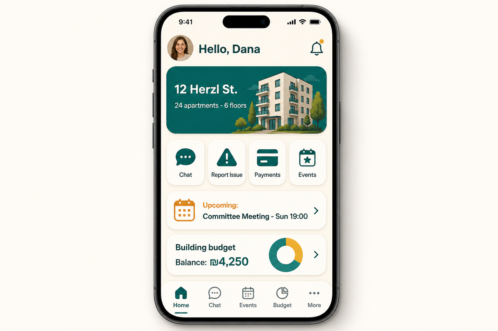
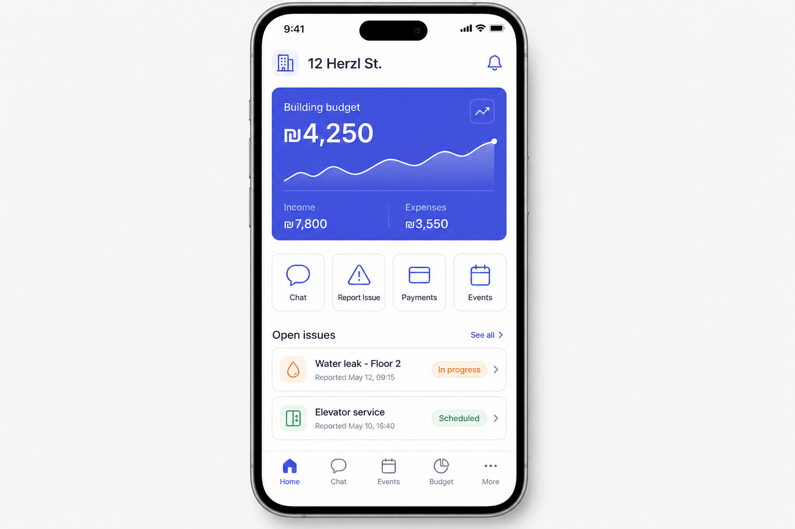
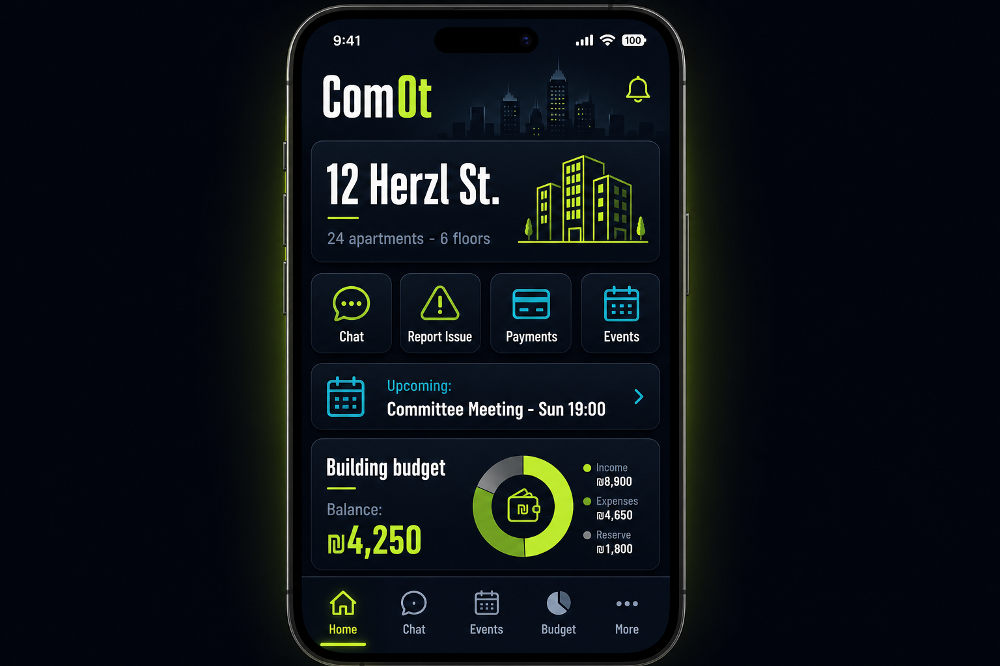

# ComOt — Design Direction Proposals

Three visual directions for the ComOt app, shown on the same home screen so they can be compared fairly. **All three are built RTL-first** (Hebrew default) and adapt cleanly to LTR English.

> **Status: ✅ APPROVED — Direction 2 "Clean Ledger"** was selected by the product owner (2026-06-11). Direction 2 is now the design system for the app and the marketing landing page. Logo selection is in progress — see [`LOGO_OPTIONS.md`](LOGO_OPTIONS.md).

---

## Direction 1 — "Warm Community"

| Token | Value |
| --- | --- |
| Background | Cream `#FAF6EF` |
| Primary | Deep teal `#0E6B5C` |
| Accent | Warm amber `#F2A33C` |
| Surfaces | White cards, 20px+ radius, soft shadows |
| Typography | Friendly rounded sans — *Heebo* (Hebrew) / *Nunito Sans* (Latin) |

**Personality:** warm, neighborly, trustworthy. A building is a community, not a bank account.

**Why recommended:**
- Fits the audience: a Va'ad app is used by all ages; warm colors and large rounded touch targets read as approachable and easy.
- Teal + amber gives clear semantic separation: teal = actions/navigation, amber = money & alerts (fees, deficits, reminders).
- Differentiates from typical property-management tools, which all look like Direction 2.
- Works beautifully in Hebrew: Heebo was designed for Hebrew UI text.

---

## Direction 2 — "Clean Ledger" ✅ APPROVED

| Token | Value |
| --- | --- |
| Background | White / light gray `#F4F5F7` |
| Primary | Indigo `#4F46E5` |
| Surfaces | 12px radius, thin borders, data-forward cards |
| Typography | Geometric sans — *Assistant* (Hebrew) / *Inter* (Latin) |

**Personality:** precise, financial, professional — a fintech/SaaS aesthetic that puts the budget front and center.

**Best if:** the product should lead with money management and reporting credibility (e.g., when pitching to professional building-management companies later).

---

## Direction 3 — "Urban Night"

| Token | Value |
| --- | --- |
| Background | Deep slate `#0F172A` |
| Primary accent | Lime `#A3E635` |
| Secondary accent | Cyan `#22D3EE` |
| Surfaces | Elevated dark cards `#1E293B` |
| Typography | Bold condensed headings + clean sans body |

**Personality:** bold, modern, high-contrast urban look with a skyline motif.

**Best if:** targeting a younger, design-forward audience; works great as an optional dark theme regardless of the chosen direction.

---

## Comparison

| Criterion | D1 Warm Community | D2 Clean Ledger | D3 Urban Night |
| --- | --- | --- | --- |
| Approachability (all ages) | ★★★ | ★★ | ★ |
| Financial credibility | ★★ | ★★★ | ★★ |
| Differentiation | ★★★ | ★ | ★★★ |
| Hebrew/RTL typography fit | ★★★ | ★★★ | ★★ |
| Accessibility (contrast, daylight use) | ★★★ | ★★★ | ★★ |

**Decision:** **Direction 2 — "Clean Ledger" was approved** as the primary design system. Direction 3's palette remains a candidate for a future dark theme.

---

## Next steps following approval

1. ✅ Landing page (`landing/`) restyled to Direction 2.
2. ✅ Logo selected — Option B "C Monogram Building", see [`LOGO_OPTIONS.md`](LOGO_OPTIONS.md).
3. Design tokens (colors, spacing, radii, typography) to be codified in the shared UI package when the app is scaffolded.
4. Core screens to be specced: onboarding, home, chat, fault report, budget, events/polls, vendor marketplace, committee settings.
