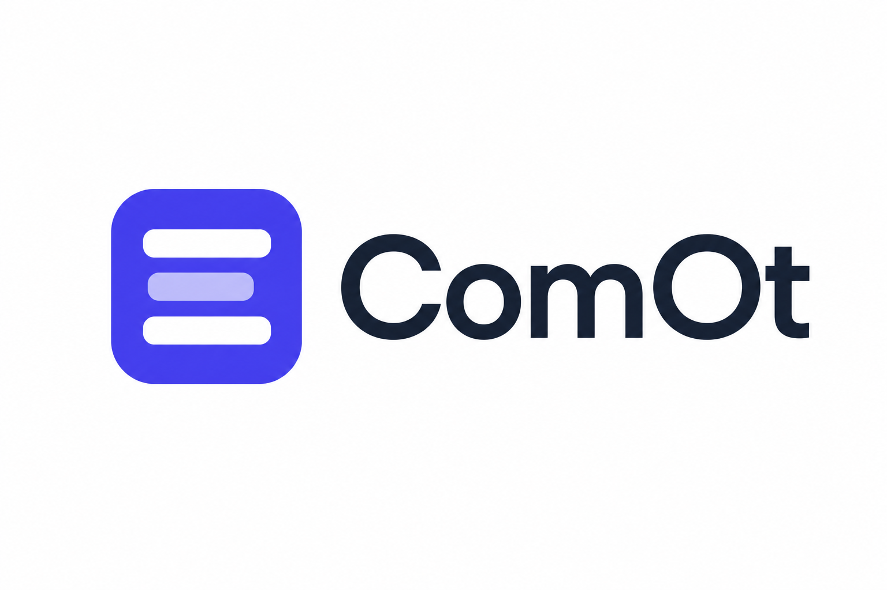
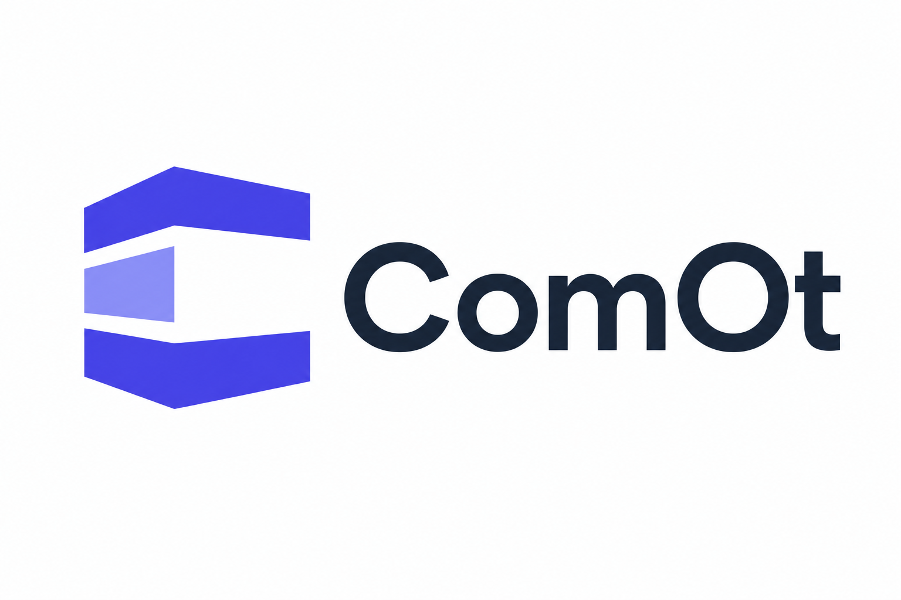
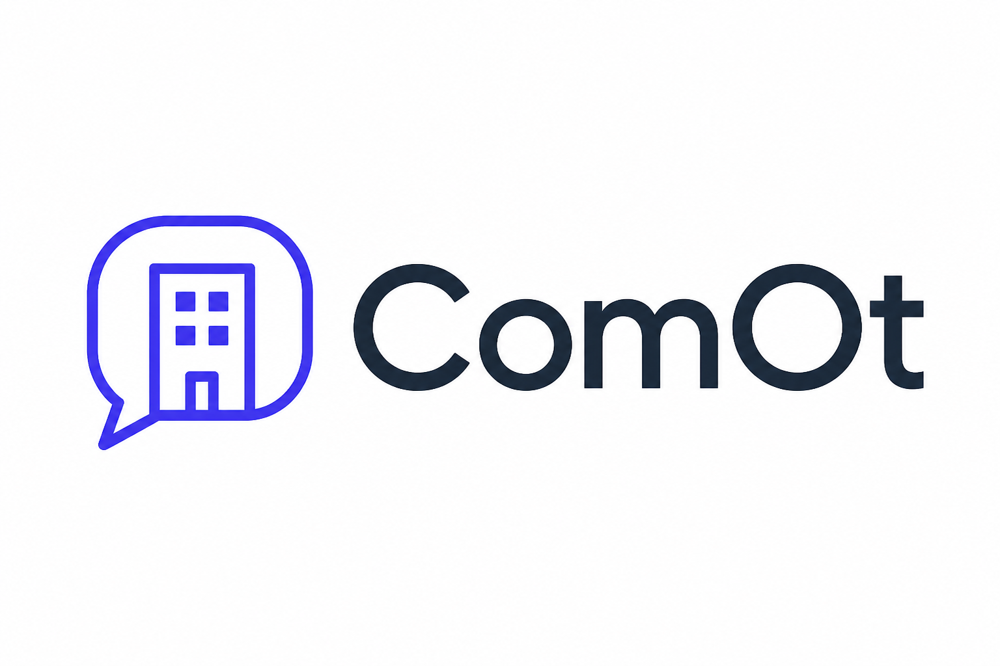
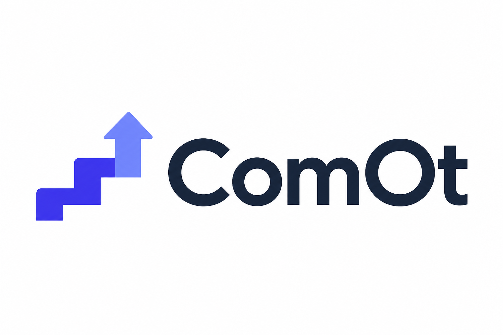

# ComOt — Logo Options

Four logo concepts, all in the approved **Direction 2 — "Clean Ledger"** palette (indigo `#4F46E5`, periwinkle `#C7D2FE`/`#818CF8`, dark slate `#1E293B`).

> **Status: awaiting selection.** Once an option is chosen, it will be redrawn as production SVG (mark + wordmark + app icon variants, light/dark backgrounds) and applied to the landing page and app.

---

## Option A — Floors Mark

Rounded app-icon square with three stacked floor bars; the highlighted middle bar suggests "your floor / your building".

- **Pros:** instantly readable at app-icon size; the floors metaphor maps directly to the name "Komot"; simplest to reproduce.
- **Cons:** abstract bars are a common motif (lists/menus).

## Option B — C Monogram Building

A bold "C" built from stacked floor slabs, like a building cross-section.

- **Pros:** ownable monogram; strong and distinctive; works as a favicon.
- **Cons:** boldness reads slightly industrial; needs careful sizing at very small scales.

## Option C — Building in a Chat Bubble

A minimal building inside a speech bubble — community and communication in one mark.

- **Pros:** tells the product story best (tenants talking about their building); friendly.
- **Cons:** thin line work loses detail at small app-icon sizes; would need a thicker icon variant.

## Option D — Ascending Steps

Floors rising like steps into an upward arrow — "Komot" (floors) + growth/progress.

- **Pros:** dynamic, optimistic; the arrow doubles as a "things getting resolved" story.
- **Cons:** arrow motif is common in fintech; weakest direct connection to buildings.

---

## Comparison

| Criterion | A — Floors | B — Monogram | C — Chat Bubble | D — Steps |
| --- | --- | --- | --- | --- |
| Legibility at app-icon size | ★★★ | ★★ | ★ | ★★★ |
| Connection to "Komot"/buildings | ★★★ | ★★ | ★★★ | ★★ |
| Distinctiveness | ★ | ★★★ | ★★ | ★★ |
| Story (community + management) | ★ | ★ | ★★★ | ★★ |

**Recommendation:** **Option A** for maximum clarity as an app icon, or **Option C** if the community/chat story should lead the brand (with a bolder small-size variant). The landing page currently uses a simplified version of Option A as a placeholder mark.
