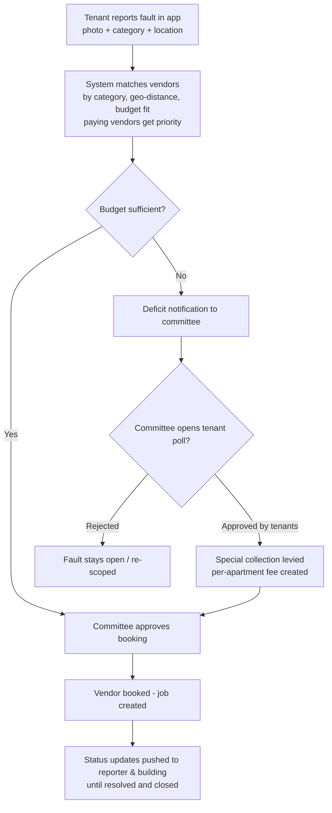

# ComOt (קומות) — Product Specification

ComOt (from the Hebrew "Komot" — floors) is a residential building management platform for tenants, house committees (Va'ad Bayit), and service providers.

- **Platforms:** iOS, Android, Web (Chrome)
- **Languages:** Hebrew (RTL) and English at launch; architecture supports adding more
- **Tenancy model:** every building is a fully isolated account — a closed ecosystem

---

## 1. Roles

| Role | Description |
| --- | --- |
| **Committee member (Va'ad / admin)** | Sets up the building, approves tenants, configures fees and notifications, manages budget, vendors, events, polls. A building can have more than one committee member. |
| **Tenant — owner** | Apartment owner. Full tenant features; flagged as `owner`. |
| **Tenant — renter** | Renter. Full tenant features; flagged as `renter`. |
| **Vendor (service provider)** | Registers independently (cross-building), publishes expertise, service area, and contact details. Receives and accepts job bookings. |

## 2. Core Features

### 2.1 Tenant Management
- Add / edit / delete tenant records.
- Per-tenant data: full name, apartment + floor, phone, email, photo, owner/renter flag, additional contacts (e.g., landlord of a rented apartment).
- **Self-registration:** tenants sign up with social login (Google / Apple / Facebook), pick their building and apartment, and enter a **pending** state until a committee member approves or rejects them.
- Committee can also invite tenants directly (invite link / QR code per building).

### 2.2 Internal Chat
- **Building channels (public):** default `#general` channel + committee-created channels (e.g., `#announcements`, read-only for tenants).
- **Private messages:** 1-on-1 chats between tenants in the same building.
- Realtime delivery, typing indicators, image attachments, push notifications.
- Chat is scoped to the building — no cross-building visibility, ever.

### 2.3 Event Management
- **Routine events:** recurring, e.g., monthly Va'ad fee collection, quarterly elevator service. Defined with a recurrence rule (frequency, day of month, etc.).
- **Ad-hoc events:** one-time, e.g., burst water pipe, committee meeting, building maintenance day.
- Each event has: type, title, description, date/time, location, linked budget items, linked fault report (optional), attendees/RSVP.

### 2.4 Committee Meeting Management
- Create a meeting event with agenda items.
- **Virtual meeting room:** dedicated realtime discussion thread per meeting; optional external video link (e.g., Google Meet/Zoom).
- **Live polls:** committee launches polls during (or outside) a meeting — single/multiple choice, anonymous or named, with deadline. Results visible live; outcomes are recorded on the meeting protocol.
- Meeting summary/protocol stored and shared with all tenants.

### 2.5 Budget Management
- **Income:** Va'ad fee collections per apartment, special one-time collections, other income.
- **Expenses:** recurring (gardening, electricity, cleaning, elevator maintenance) and one-time (e.g., pipe repair), each linked to a vendor and optionally to a fault/event.
- Running balance per building, monthly breakdowns, deficit detection.
- Payment status tracking per apartment per period (paid / pending / overdue).

### 2.6 Vendor Management
- Building-level vendor book: add / remove vendors, mark preferred vendors per category.
- **Vendor marketplace:** vendors self-register on the platform with expertise categories (plumber, gardener, electrician, elevator tech, roofing, …), geographic service area, contact info, and pricing hints.
- Free in phase 1; later, a monthly subscription gives paying vendors **priority in automatic matching**.

### 2.7 Notifications & Reports (issues)
- Push + in-app notifications. Examples:
  - Tenant: Va'ad fee due-date reminder, payment confirmation, poll opened, fault status changed.
  - Committee: budget deficit alert, new tenant pending approval, new fault reported, vendor accepted a job.
- **Fault / hazard reporting:** tenants report issues with category, description, photos, and location in the building. Status lifecycle: `reported → matched → approved → booked → in_progress → resolved → closed`.

### 2.8 Report Generation
- Expense reports (by period, category, vendor).
- Income reports (fee collection rates, outstanding debts per apartment).
- Vendor/service-provider availability report by category and area.
- Export to PDF / CSV; localized (he/en).

## 3. Key Flow — "Tenant Identifies a Fault"

## 4. Committee Configuration

The committee can configure per building:

- Va'ad fee **amount**, **due date**, and **frequency** (monthly by default).
- Notification policy: which events trigger notifications, channels (push/email), reminder timing (e.g., 3 days before due date, on due date, weekly when overdue).
- Tenant approval policy and channel permissions.

## 5. Building Setup & Committee Handover

- A committee member creates the building: address, floors, number of apartments, parking/storage info, and other useful metadata. Apartments are generated and tenants are attached to them.
- **Handover:** the outgoing committee member selects a successor in-app → the successor receives a notification → the **admin role transfers only after the successor explicitly confirms**. Until confirmation the outgoing member retains the role. All handovers are audit-logged.

## 6. Non-Functional Requirements

| Requirement | Approach |
| --- | --- |
| **Multi-tenancy / isolation** | Every record carries a `building_id`; isolation is enforced at the database layer (PostgreSQL Row-Level Security), not only in application code. Vendors are global entities exposed to buildings only through the matching/marketplace surface. |
| **Localization** | Full i18n (he/en) including RTL layouts, localized dates/currency (₪), localized notifications and reports. |
| **Platforms** | Single codebase for iOS, Android, and Web (Chrome) — see `TECH_STACK.md`. |
| **Scalability** | Stateless API, managed Postgres, realtime via managed channels, queue-based notification fan-out. See `TECH_STACK.md` for the scaling path. |
| **Source control** | GitHub, under the owner's username — see `REPOSITORIES.md`. |

## 7. Phasing

1. **Phase 0 (this PR):** design selection, marketing landing page, tech stack, repository layout.
2. **Phase 1 (MVP):** auth + social login, building setup, tenant management with approval, chat, fault reporting, basic budget, basic notifications.
3. **Phase 2:** vendor marketplace + automatic matching, polls/meetings, special collections, reports/exports.
4. **Phase 3:** vendor subscriptions (payments), priority matching, advanced analytics.
